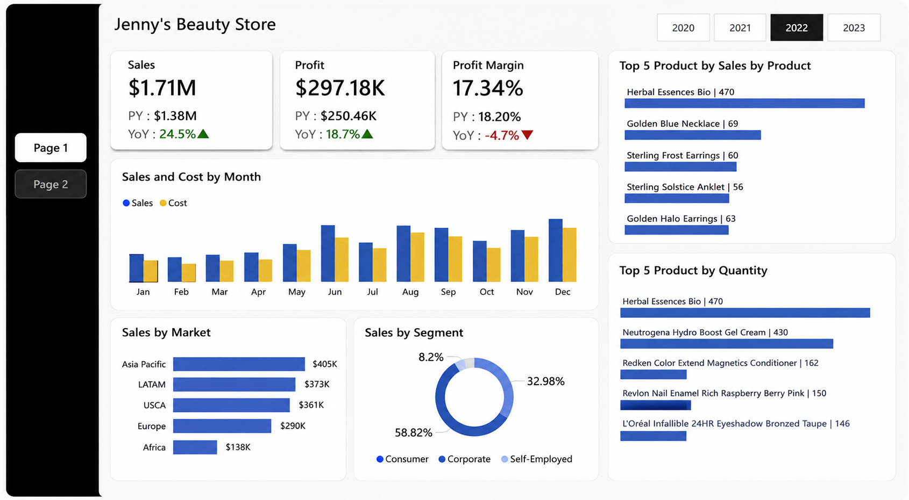
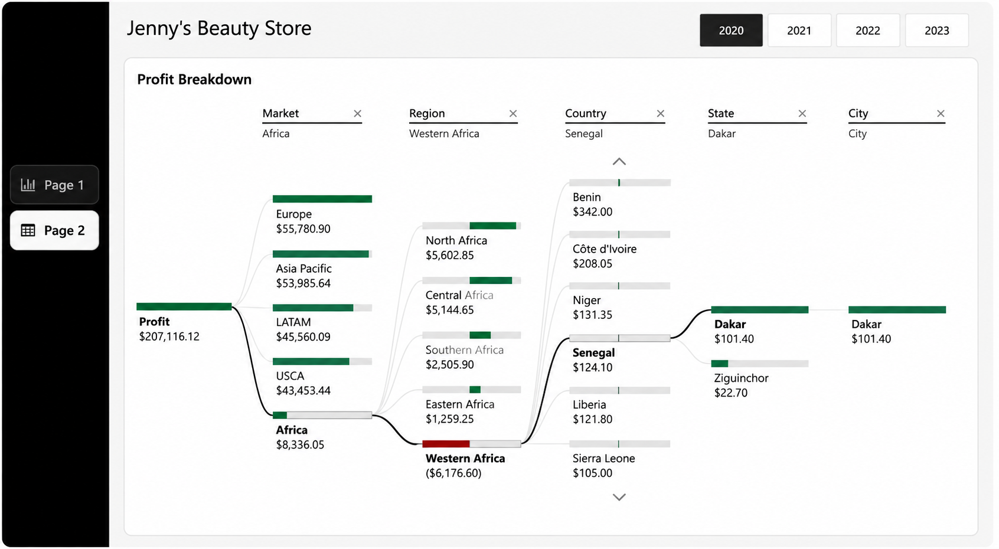

# Jenny's Beauty Store — Tableau de bord Power BI

## Présentation du projet

Ce projet présente un tableau de bord interactif développé avec **Microsoft Power BI** afin d’analyser les performances commerciales d’une boutique de commerce électronique spécialisée dans les produits de beauté.

L’objectif principal est de fournir une vue claire des ventes, des coûts, du profit et de la marge bénéficiaire, tout en permettant une exploration détaillée des performances selon les produits, les marchés, les segments de clientèle et les zones géographiques.

Le rapport contient **deux pages** :

1. une page de synthèse des principaux indicateurs de performance ;
2. une page d’analyse détaillée du profit avec un arbre de décomposition.

---

## Aperçu du tableau de bord

### Page 1 — Vue d’ensemble des performances



Cette page présente les principaux indicateurs de performance de la boutique :

- chiffre d’affaires total ;
- profit total ;
- marge bénéficiaire ;
- valeur de l’année précédente, ou **PY — Previous Year** ;
- variation annuelle, ou **YoY — Year over Year**.

Elle permet également d’analyser :

- l’évolution mensuelle des ventes et des coûts ;
- les ventes par marché ;
- la répartition des ventes par segment de clientèle ;
- les cinq produits générant le plus de ventes ;
- les cinq produits les plus vendus en quantité ;
- les résultats selon l’année sélectionnée.

Le sélecteur d’années permet de filtrer l’ensemble des visualisations pour les années 2020, 2021, 2022 et 2023.

---

### Page 2 — Analyse du profit



Cette page utilise l’**arbre de décomposition Power BI** afin d’explorer le profit selon plusieurs niveaux géographiques :

- marché ;
- région ;
- pays ;
- État ou province ;
- ville.

Cette analyse hiérarchique permet d’identifier les zones qui contribuent le plus au profit ainsi que celles qui enregistrent des pertes ou de faibles performances.

---

## Objectifs métiers

Ce tableau de bord permet de répondre aux questions suivantes :

- Quel est le niveau global des ventes et du profit ?
- Comment les ventes et les coûts évoluent-ils au cours de l’année ?
- Comment les performances se comparent-elles à celles de l’année précédente ?
- Quels produits génèrent le plus de chiffre d’affaires ?
- Quels produits sont les plus vendus ?
- Quels marchés et segments de clientèle sont les plus performants ?
- Quelles régions, quels pays et quelles villes contribuent le plus au profit ?
- Où se trouvent les principales zones de sous-performance ?

---

## Fonctionnalités Power BI utilisées

- Power Query pour la préparation et la transformation des données ;
- modélisation des données ;
- mesures DAX ;
- cartes KPI ;
- calcul de l’année précédente, **PY** ;
- calcul de la variation annuelle, **YoY** ;
- filtres interactifs ;
- exploration hiérarchique avec le drill-down ;
- arbre de décomposition ;
- navigation entre les pages ;
- conception UI/UX du tableau de bord.

---

## Exemples de mesures DAX

```DAX
Total Sales =
SUM('Sales'[Sales])

Total Profit =
SUM('Sales'[Profit])

Profit Margin =
DIVIDE(
    [Total Profit],
    [Total Sales],
    0
)

Sales PY =
CALCULATE(
    [Total Sales],
    SAMEPERIODLASTYEAR('Date'[Date])
)

Sales YoY % =
DIVIDE(
    [Total Sales] - [Sales PY],
    [Sales PY],
    0
)
